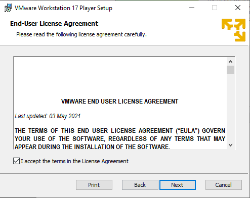
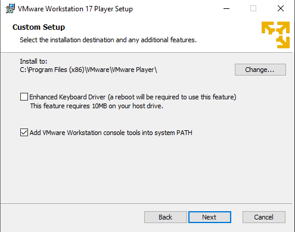
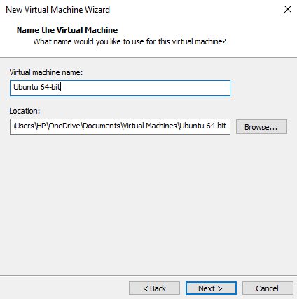

#                            Lab Manual

# Task 1:

## VMware Workstation 17 Player

Download  VMware Workstation 17 Player from the link:

https://www.vmware.com/in/products/workstation-player/workstation-player-evaluation.html

* Install executable file and double **click ** on the file 

  

* Now **accept** the  License agreement and click on the next button

* **Click** on the Next button

  

  

  - Select the path and tick the second option and click on **Next**

  

  

  - Then click on the **Next**

  

  - Again click on the **Next**

    

    

  - Click on the **Next**

    

    

  - Wait for the ***Installation*** to complete

    

    

  - After installation click on the **Finish**

    

    

  ------

  

  ## 2. Download Ubuntu

  #### Ubuntu Desktop

  - **Download** Ubuntu Desktop from the link given below

    https://ubuntu.com/download/desktop

    

  ------

  ## 3. Setup Ubuntu on VMware

  

  - **Open** VMware Workstation 17 Player
  - Click on **Create a New Virtual Machine**

  

  - Select **Installer disc image file(iso)** and browse the path of ***ubuntu.iso*** file and click on **Next** 

  

  

  - Enter the **Virtual Machine Name** and select the **Location** where you want to store VM and click on the **Next** 

  

  - Select the **Maximum disk space** for Ubuntu VM _(Recommended size for Ubuntu 64-bit is 20 GB)_ and click on the **Next** 

  

  ​

  - Click on the **Customize Hardware**

    

    

  - Select **4GB Memory** for Virtual Machine 

    

  - Click on **New CD/DVD(SATA)** then choose the **Use ISO Image file** and browse to the Ubuntu.iso file and click on the **Close** 

  

  ​

  - Click on the **Finish** 

  

  - After the setup it will take some time to launch VM

    

  

  ​

  ## Completed

  

  ​

# Task 2:

First of all, you have to open ubuntu from VMware. Right click on the screen, some options will appear select the option, Open in Terminal.

Terminal will be open and  will look like this.

The first command touch hello.cpp will create c++ file named as hello.cpp.  ls command will show the file on the terminal. 

Now, you can see hello.cpp file on the desktop screen.

The clear command is used to clear the terminal.

gedit hello.cpp will open the cpp file to write the c++ code.

The following window will appear after the gedit command.

You can write the code on this window like this and then click on the save button that is on the top of this window to save the code.

If you want to write the code on the terminal you can use nano command as given below.

If you want to see what is in the cpp file, you can use cat command as given below.

If you don't have g++ compiler, you can install it by using the given command.

Another way to install g++ compiler is by using the given command.

g++ compiler is installing given below.

If you to make OS file from cpp file you can use the command given below.

You can see OS file in the window given below.

If you want to make three files related to hello file, you can use the command given below.

You can see these files in the window below.

