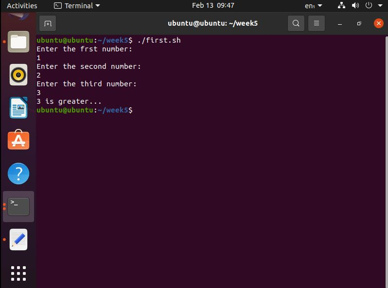
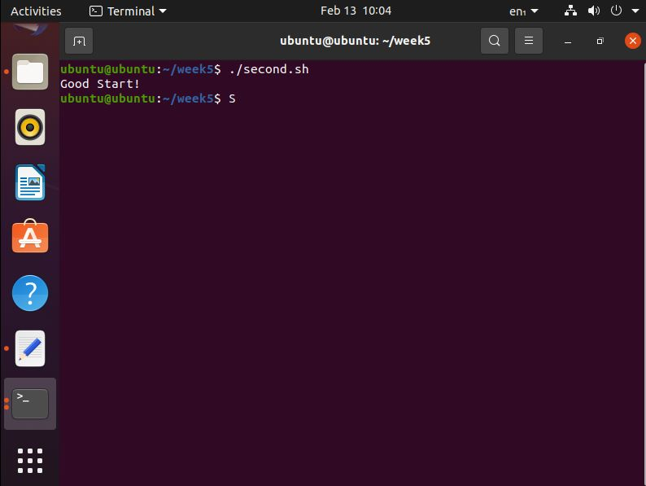
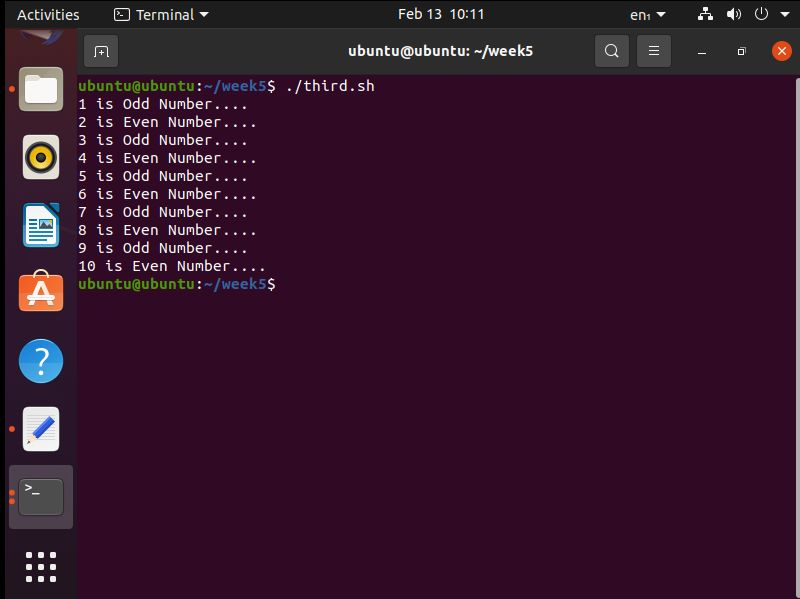
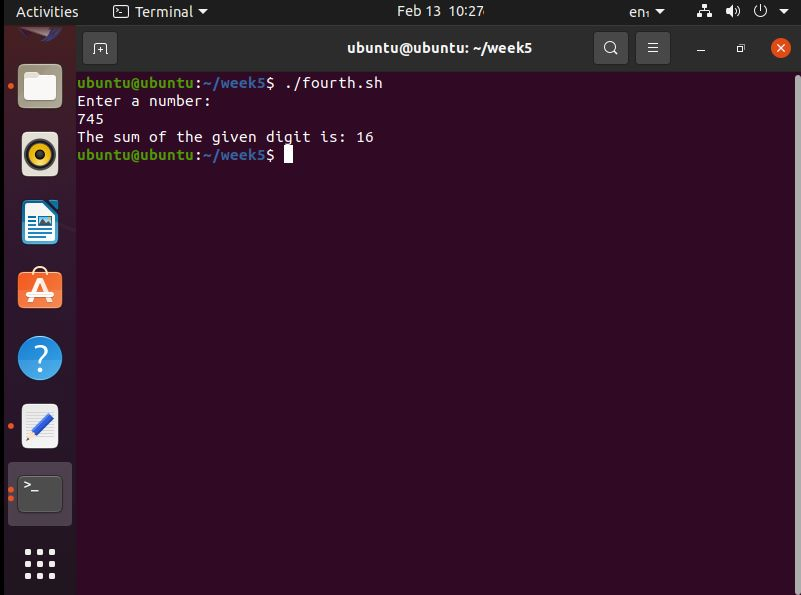

## Manual : -

### Part 1:

1. Echo command is used for showing a string on the screen and read command is used for reading the input from the terminal and save it into the variable you're write with read command. If command is a conditional Statement in ubuntu its syntax is followed. 

>  [variable1 comparing_operator variable2] then echo "any message you want print or condition"

2. Inside the square brackets num1 is compared with num2. $ (Dollar) sign is used for comparing the value in that variable and -gt is operator same as greater than.

```shell
#! /bin/bash
echo "Enter Number"
read num1
echo "Enter Number"
read num2
echo "Enter Number"
read num3

if [ $num1 -gt $num2 ] && [ $num1 -gt $num3 ]
then
    echo $num1 ' is the larger number'
elif [ $num2 -gt $num1 ] && [ $num2 -gt $num3 ]
then
    echo $num2 ' is the larger number'
else
    echo $num3 ' is the larger number'
fi
```

3. The following Output will be shown.



### part2.

1. In variable day we take a day from our system using  $(date +%A). date is carried out from our system. different cases that are checked from a variable that is selected from case statement then the day is compared with below cases. The one that matches output in that condition.

```shell
#!/bin/bash

day=$(date +%A)

case $day in
    Monday)echo "Happy start of week Good Day";;
    Tuesday)echo "Happy Tuesday HAve a nice Day";;
    Wednesday)echo "Happy Hump Day! BE HAppy";;
    Thursday)echo "Happy Thurusday Good Journay";;
    Friday)echo "Have a blessed weekend Love U";;
    Saturday)echo "Happy Holiday See you Soon";;
    Sunday)echo "Happy Holiday HAppy Rest Day";;
    *)echo "Sorry, I don't recognize this day.";;
esac
```

2. The following output will be shown.



## Task 02

### part1

1. In this problem we use a counter variable in which we assign a value of 1 as :

```shell
#!/bin/bash
counter=$1
until [ $counter -gt 10 ]
do
    if (( $counter % 2 == 0 ))
    then
        echo "$counter is even"  
    else
        echo "$counter is odd"
    fi
    ((counter++))
done
```

2. The following output will be shown.



### part2

1. Following program will sum up the values of the integer as one as :

```shell
#!/bin/bash
echo "Enter a number: "
read number
summation=0
while [ $number -gt 0 ];
 do
  mod_take=$((number % 10))
  summation=$((summation + mod_take))
  number=$((number / 10))
done
echo "Total value is :- $summation"
```

2. This code will generate following output.


